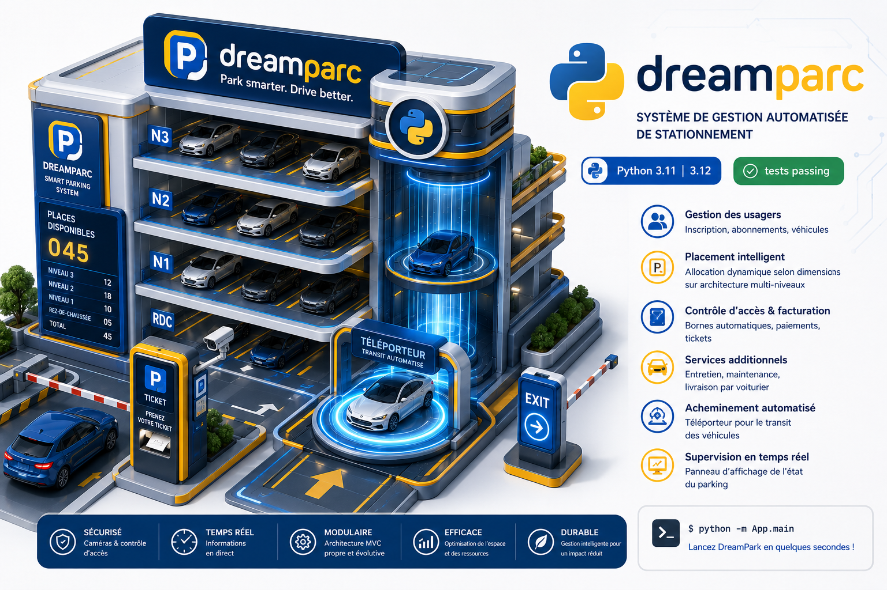

# DreamPark – Système de Gestion Automatisée de Stationnement




DreamPark est un système d'information modulaire développé en Python pour la gestion intelligente de parkings. Il orchestre l'accès automatisé des véhicules, l'allocation dynamique des emplacements, la facturation, et l'intégration de services annexes (entretien, maintenance, livraison par voiturier).

## 📦 Fonctionnalités principales

- **Gestion des usagers** – Inscription des clients, abonnements, liaison avec les véhicules.
- **Placement intelligent** – Allocation d'emplacements selon les dimensions (hauteur, longueur) sur une architecture multi-niveaux.
- **Contrôle d'accès et facturation** – Bornes automatiques, paiements par carte ou espèces, émission de tickets.
- **Services additionnels** – Planification d'entretien, maintenance, livraison par voiturier.
- **Acheminement automatisé** – Téléporteur simulant le transit des véhicules entre accès et emplacements.
- **Supervision en temps réel** – Panneau d'affichage de l'état du parking.

## 🏗️ Architecture logicielle

Le projet suit le patron **Modèle-Vue-Contrôleur (MVC)** pour garantir une séparation claire des responsabilités :

```
dream_park/
├── App/                    # Point d'entrée (main.py) et boucle interactive
├── controller/             # Contrôleurs (tickets, procédures entrée/sortie)
├── parking/                # Cœur métier : Parking, Niveau, Place, Acces, BorneTicket, Voiture, Camera, Teleporteur
├── service/                # Services clients : abonnements, livraison, entretien, maintenance
├── interface/              # Composants d'affichage (PanneauAffichage)
├── parking_test/           # Tests unitaires pour le module parking
├── service_test/           # Tests unitaires pour le module service
├── interface_test/         # Tests unitaires pour l'interface
└── requirements.txt        # Dépendances (si nécessaires)
```

## 🔧 Prérequis

- Python 3.11 ou 3.12 (recommandé)
- pip pour la gestion des paquets
- Environnement virtuel (recommandé)

## 🚀 Installation

**1. Cloner le dépôt :**

```bash
git clone https://github.com/votre-utilisateur/dream_park.git
cd dream_park
```

**2. Créer et activer un environnement virtuel :**

```bash
python -m venv dream_park_env
source dream_park_env/bin/activate          # Linux/macOS
# dream_park_env\Scripts\activate           # Windows
```

**3. Installer les dépendances (si un `requirements.txt` existe) :**

```bash
pip install -r requirements.txt
```

> Par défaut, le projet utilise uniquement la bibliothèque standard Python, donc aucune installation supplémentaire n'est requise.

## ▶️ Utilisation

Lancer l'application interactive en ligne de commande :

```bash
python -m App.main
```

Vous serez accueilli par un menu vous guidant à travers les opérations :

- Inscription d'un client
- Ajout d'une voiture
- Entrée et sortie du parking
- Consultation des tickets
- Accès aux services (entretien, maintenance, livraison)

## 🧪 Assurance qualité & Tests unitaires

La suite de tests repose sur `unittest` et utilise `unittest.mock` (`patch`, `MagicMock`) pour isoler les dépendances.

**Exécuter tous les tests :**

```bash
python -m unittest discover
```

**Exécuter les tests d'un module spécifique (ex. `parking_test`) :**

```bash
python -m unittest discover -s parking_test
```

## 📁 Structure détaillée du code (extrait)

| Fichier | Rôle |
|---|---|
| `parking/gestion_parking.py` | Implémente le singleton `Parking` et la logique de recherche de places. |
| `parking/niveau.py` | Représente un niveau avec ses places et ses dimensions. |
| `parking/place.py` | Modélise une place individuelle (libre/occupée). |
| `parking/acces.py` | Gère les procédures d'entrée/sortie et l'interaction avec la borne, la caméra et le téléporteur. |
| `service/client.py` | Gère les clients, abonnements et services. |
| `controller/ticket.py` | Génère et affiche les tickets. |

## 🤝 Contribuer

Les contributions sont les bienvenues ! Merci de suivre ces étapes :

1. Forkez le projet.
2. Créez une branche pour votre fonctionnalité (`git checkout -b feature/ma-fonctionnalite`).
3. Commitez vos changements (`git commit -m 'Ajout de ma fonctionnalité'`).
4. Poussez vers la branche (`git push origin feature/ma-fonctionnalite`).
5. Ouvrez une Pull Request.


---

**Auteurs :** Assane Kane


*Dernière mise à jour : Juillet 2026*
